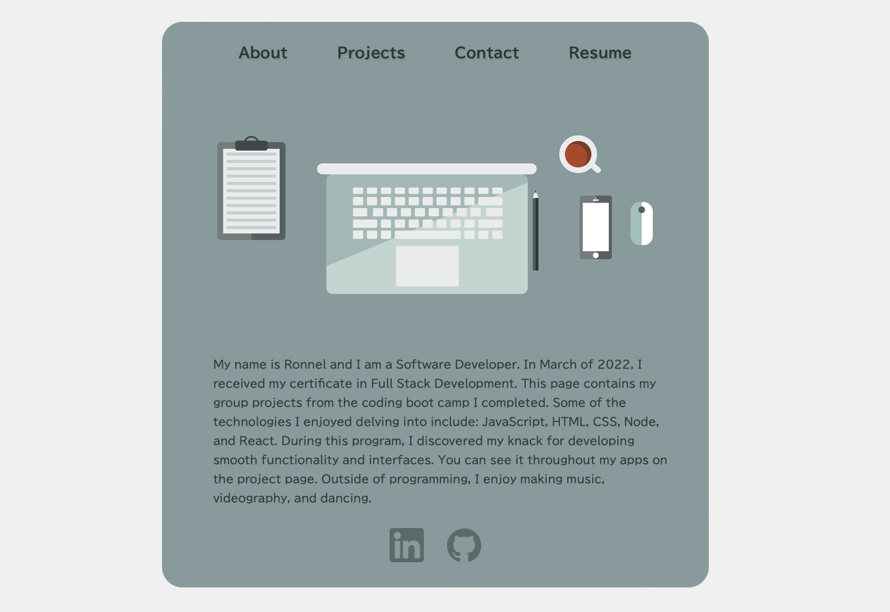

# Portfolio

https://rabrigo.github.io/portfolio/

Table of Contents

  <ol>
    <li><a href="#description">Description</a></li>
    <li><a href="#built-with">Built With</a></li>
    <li><a href="#installation">Installation</a></li>
    <li><a href="#acknowledgements">Acknowledgements</a></li>
    <li><a href="#future-updates">Future Updates</a></li>
  </ol>

## Description
This is a portfolio that showcases my group projects from my coding boot camp. There are currently four pages total. The interface is also mobile responsive. I chose the color scheme from the vector art I found on pixabay (Adobe Colors). 

## Built With
HTML, CSS, ReactJS, and React Router. 

## Installation
If you wish to install a copy locally, copy the SSH URL from the project page, and in your CLI run `git clone ` with the SSH URL pasted right after. Run `npm install` to install the node modules. Open your CLI onto the root directory and execute `npm run start`.

## Acknowledgements
The graphic on the 'About' page is from pixabay user ptra.

## Future Updates
I used CSS animations for Browser Party that I would like to incorporate into this page.